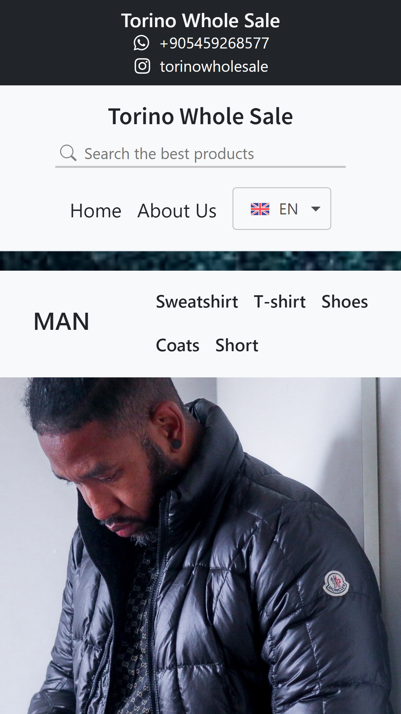

# Making a Responsive Clothing Portfolio Website (One Page) With Data From Rest API  

Locally, i printed the data to the product component using the json file I created with the json server.

## Scripts I Have Added in <code>package.json</code>

For womanproduct.json => <code>start:server</code>. This json document will start on port 3500

For womansweatproduct.json => <code>start:server:second</code>. This json document will start on port 3600

# How Looking Web Site 

## Look at Mobile

## What Technologies ​​Did I Use?

    
    
    
    
    

